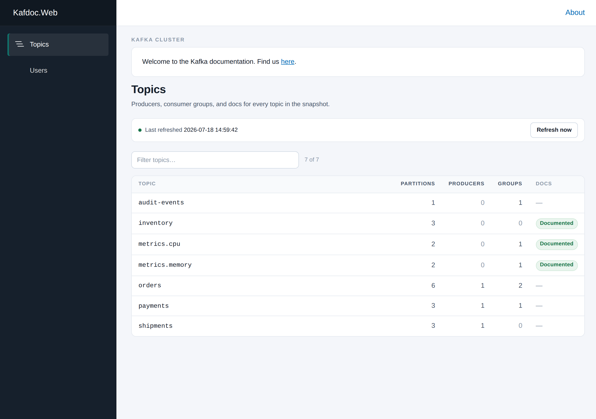
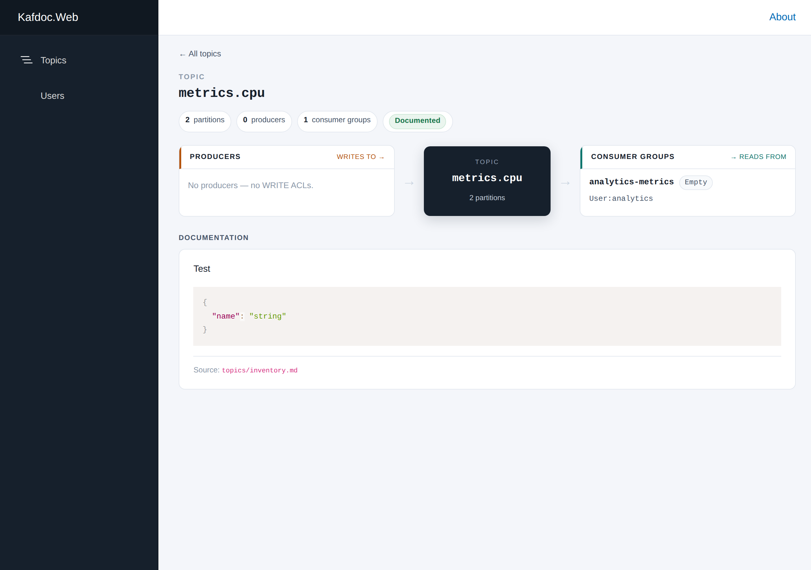
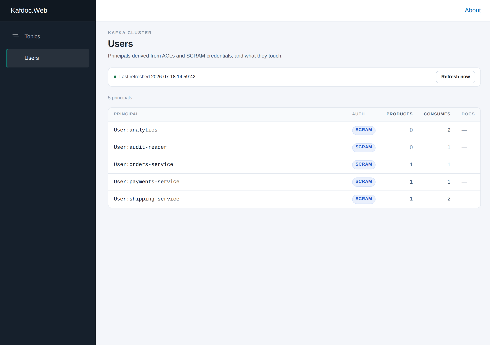
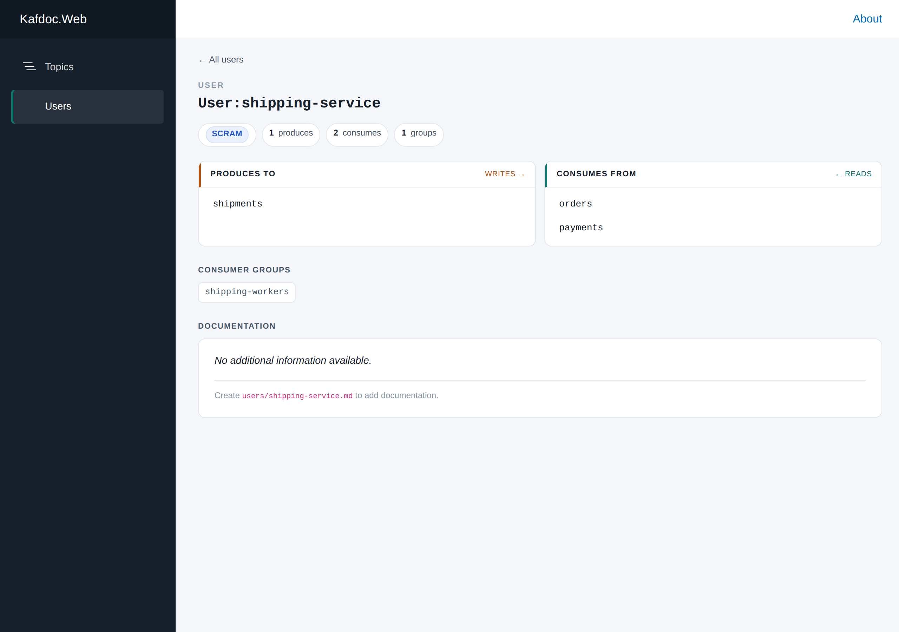

# kafdoc

Kafdoc is a read-only documentation site for a single **secured Apache Kafka cluster**.
It reads your topics, ACLs, SCRAM users, and consumer groups through the Kafka Admin API
and turns them into a browsable map of *who produces what*, *who consumes what*, and *how
they are connected* — with room for hand-written markdown docs layered on top.

It is an experiment in building a documentation system for Apache Kafka using agentic coding.

## What it does

Kafka tells you a lot about itself if you ask the right questions, but that information is
scattered across metadata, ACLs, and offset commits — and none of it is human-friendly.
Kafdoc stitches those facts into a single graph:

- **Producers** are derived from `WRITE` ACLs on topics.
- **Consumer groups** and their **consumers** come from `READ` ACLs plus committed
  consumer-group offsets.
- The **user ↔ group** bridge comes from group-resource `READ` ACLs.
- `LITERAL`, `PREFIXED`, and `*` ACL patterns are expanded so wildcard grants show up
  against every topic they actually cover.

Everything is held **in memory** — there is no database. On startup, and then on a
configurable interval (hourly by default), a background service re-reads the cluster and
atomically swaps in a fresh immutable snapshot. If a refresh fails, the previous snapshot
keeps serving (stale-but-serving beats empty).

## Screenshots

### Topics

Every topic in the snapshot, with partition counts, producer/consumer-group counts, and
whether hand-written documentation exists for it.



### Topic detail

A producer → topic → consumer-group flow diagram for a single topic, plus any markdown
documentation you have written for it.



### Users

Every principal derived from ACLs and SCRAM credentials, and what each one produces and
consumes.



### User detail

What a single principal writes to, reads from, and which consumer groups it belongs to.



## Running the published Docker image

A pre-built image is published at
[`nilslattek/kafdoc`](https://hub.docker.com/r/nilslattek/kafdoc), so you don't need the
SDK or the source to run Kafdoc — you only need your connection settings and (optionally)
your markdown docs.

Configuration is supplied through environment variables. Nested config keys use a double
underscore (`__`) as the separator:

```bash
docker run --rm -p 8080:8080 \
  -e Kafka__BootstrapServers="your-broker:9092" \
  -e Kafka__SecurityProtocol="SaslSsl" \
  -e Kafka__SaslMechanism="ScramSha512" \
  -e Kafka__SaslUsername="your-admin-user" \
  -e Kafka__SaslPassword="your-admin-password" \
  nilslattek/kafdoc
```

The app listens on port `8080` inside the container.

### Baking in your documentation

To ship your own markdown docs with the image, build a thin Dockerfile `FROM` the published
image, point `Documentation__RootPath` at a folder, and copy your files into it. Lay your
docs out with `topics/` and `users/` subfolders and an optional `index.md`:

```
docs/
├── index.md            # intro shown on the Topics page
├── topics/
│   ├── orders.md
│   └── payments.md
└── users/
    └── orders-service.md
```

```dockerfile
FROM nilslattek/kafdoc:latest

# Where Kafdoc looks for index.md, topics/*.md and users/*.md
ENV Documentation__RootPath=/docs

# Copy your local docs/ folder into that path
COPY docs/ /docs/
```

Then build and run your image:

```bash
docker build -t my-kafdoc .
docker run --rm -p 8080:8080 \
  -e Kafka__BootstrapServers="your-broker:9092" \
  -e Kafka__SecurityProtocol="SaslSsl" \
  -e Kafka__SaslMechanism="ScramSha512" \
  -e Kafka__SaslUsername="your-admin-user" \
  -e Kafka__SaslPassword="your-admin-password" \
  my-kafdoc
```

If you'd rather not rebuild the image every time the docs change, mount the folder instead
of copying it — `-e Documentation__RootPath=/docs -v "$(pwd)/docs:/docs:ro"` on a plain
`docker run` of the base image achieves the same result.

## Documentation overlay

The cluster graph is discovered automatically, but Kafdoc also lets operators enrich it
with markdown files. Point the `Documentation:RootPath` setting at a folder containing:

- `index.md` — an introduction shown at the top of the Topics page.
- `topics/<name>.md` — documentation for a topic.
- `users/<name>.md` — documentation for a principal.

Files are matched by name (slug), or you can target several entities from one file using
YAML front matter with `*` glob patterns:

```markdown
---
topics:
  - "orders.*"
  - "payments"
---
# Order & payment topics
Shared documentation for everything in the ordering domain.
```

Markdown is rendered inline on the relevant detail page, and topics/users that have docs
are flagged with a **Documented** pill in the lists.

## Architecture

Kafdoc follows domain-driven design with a four-project dependency chain
`Web → Application → Domain ← Infrastructure` (Domain has no outbound dependencies). The
data is a **read model**: Infrastructure fetches raw Kafka facts, a pure domain service
derives the graph, Application stores an immutable snapshot and exposes query services, and
a background service refreshes it on a timer.

| Project | Responsibility |
| --- | --- |
| `Kafdoc.Domain` | The immutable read model and `ClusterGraphBuilder`, a pure service that turns raw Kafka facts into the producer/consumer graph. Thoroughly unit-tested. |
| `Kafdoc.Application` | Orchestration and the query API — the snapshot store, the timed refresh service, and the DTO-returning query services. |
| `Kafdoc.Infrastructure` | The Kafka adapter (`Confluent.Kafka` `IAdminClient`) and the file-based documentation store. Contains no derivation logic. |
| `Kafdoc.Web` | Blazor Server UI that reads the snapshot directly through the query services. |

## Getting started with the C# code

### Prerequisites

- The [.NET 10 SDK](https://dotnet.microsoft.com/download).
- A reachable, SCRAM-secured Kafka cluster. The devcontainer in this repo starts one
  automatically (`kafka:9092`, admin user `admin` / `admin-secret`).

### Configure the connection

Set the `Kafka` section in `appsettings.json` or user-secrets:

```jsonc
"Kafka": {
  "BootstrapServers": "your-broker:9092",
  "SecurityProtocol": "SaslSsl",
  "SaslMechanism": "ScramSha512",
  "SaslUsername": "your-admin-user",
  "SaslPassword": "your-admin-password",
  "RefreshInterval": "01:00:00"
}
```

### Seed demo data (optional)

To fill a local dev cluster with example users, topics, ACLs, and consumer groups so the
UI has something to show:

```bash
dotnet run scripts/seed-demo-data.cs
```

### Run the app

```bash
cd src/Kafdoc.Web
dotnet run
```

Then open the printed URL (e.g. <http://localhost:5262>).

## Development

```bash
dotnet restore
dotnet build --no-restore -warnaserror   # CI treats warnings as errors
dotnet test  --no-restore                # xUnit v3 via Microsoft.Testing.Platform
```

Integration tests (`test/Kafdoc.InfrastructureTest`) spin up a real secured broker via
Testcontainers and need a reachable Docker daemon. See [CLAUDE.md](CLAUDE.md) for the full
command reference and conventions.

## License

[MIT](LICENSE) © Nils Lattek